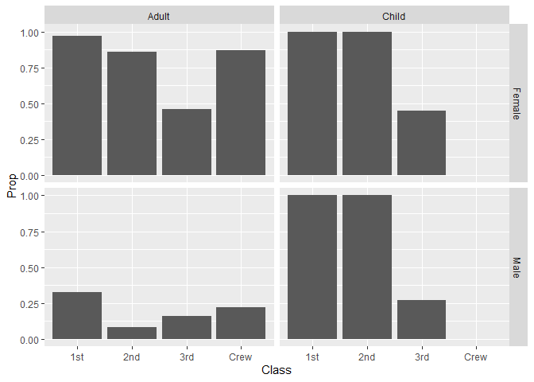

RMS Titanic
================
Isabella Abilheira
Feb 1 2023

- <a href="#grading-rubric" id="toc-grading-rubric">Grading Rubric</a>
  - <a href="#individual" id="toc-individual">Individual</a>
  - <a href="#due-date" id="toc-due-date">Due Date</a>
- <a href="#first-look" id="toc-first-look">First Look</a>
  - <a
    href="#q1-perform-a-glimpse-of-df_titanic-what-variables-are-in-this-dataset"
    id="toc-q1-perform-a-glimpse-of-df_titanic-what-variables-are-in-this-dataset"><strong>q1</strong>
    Perform a glimpse of <code>df_titanic</code>. What variables are in this
    dataset?</a>
  - <a
    href="#q2-skim-the-wikipedia-article-on-the-rms-titanic-and-look-for-a-total-count-of-souls-aboard-compare-against-the-total-computed-below-are-there-any-differences-are-those-differences-large-or-small-what-might-account-for-those-differences"
    id="toc-q2-skim-the-wikipedia-article-on-the-rms-titanic-and-look-for-a-total-count-of-souls-aboard-compare-against-the-total-computed-below-are-there-any-differences-are-those-differences-large-or-small-what-might-account-for-those-differences"><strong>q2</strong>
    Skim the Wikipedia article on the RMS Titanic, and look for a total
    count of souls aboard. Compare against the total computed below. Are
    there any differences? Are those differences large or small? What might
    account for those differences?</a>
  - <a
    href="#q3-create-a-plot-showing-the-count-of-persons-who-did-survive-along-with-aesthetics-for-class-and-sex-document-your-observations-below"
    id="toc-q3-create-a-plot-showing-the-count-of-persons-who-did-survive-along-with-aesthetics-for-class-and-sex-document-your-observations-below"><strong>q3</strong>
    Create a plot showing the count of persons who <em>did</em> survive,
    along with aesthetics for <code>Class</code> and <code>Sex</code>.
    Document your observations below.</a>
- <a href="#deeper-look" id="toc-deeper-look">Deeper Look</a>
  - <a
    href="#q4-replicate-your-visual-from-q3-but-display-prop-in-place-of-n-document-your-observations-and-note-any-newdifferent-observations-you-make-in-comparison-with-q3-is-there-anything-fishy-in-your-plot"
    id="toc-q4-replicate-your-visual-from-q3-but-display-prop-in-place-of-n-document-your-observations-and-note-any-newdifferent-observations-you-make-in-comparison-with-q3-is-there-anything-fishy-in-your-plot"><strong>q4</strong>
    Replicate your visual from q3, but display <code>Prop</code> in place of
    <code>n</code>. Document your observations, and note any new/different
    observations you make in comparison with q3. Is there anything
    <em>fishy</em> in your plot?</a>
  - <a
    href="#q5-create-a-plot-showing-the-group-proportion-of-occupants-who-did-survive-along-with-aesthetics-for-class-sex-and-age-document-your-observations-below"
    id="toc-q5-create-a-plot-showing-the-group-proportion-of-occupants-who-did-survive-along-with-aesthetics-for-class-sex-and-age-document-your-observations-below"><strong>q5</strong>
    Create a plot showing the group-proportion of occupants who <em>did</em>
    survive, along with aesthetics for <code>Class</code>, <code>Sex</code>,
    <em>and</em> <code>Age</code>. Document your observations below.</a>
- <a href="#notes" id="toc-notes">Notes</a>

*Purpose*: Most datasets have at least a few variables. Part of our task
in analyzing a dataset is to understand trends as they vary across these
different variables. Unless we’re careful and thorough, we can easily
miss these patterns. In this challenge you’ll analyze a dataset with a
small number of categorical variables and try to find differences among
the groups.

*Reading*: (Optional) [Wikipedia
article](https://en.wikipedia.org/wiki/RMS_Titanic) on the RMS Titanic.

<!-- include-rubric -->

# Grading Rubric

<!-- -------------------------------------------------- -->

Unlike exercises, **challenges will be graded**. The following rubrics
define how you will be graded, both on an individual and team basis.

## Individual

<!-- ------------------------- -->

| Category    | Needs Improvement                                                                                                | Satisfactory                                                                                                               |
|-------------|------------------------------------------------------------------------------------------------------------------|----------------------------------------------------------------------------------------------------------------------------|
| Effort      | Some task **q**’s left unattempted                                                                               | All task **q**’s attempted                                                                                                 |
| Observed    | Did not document observations, or observations incorrect                                                         | Documented correct observations based on analysis                                                                          |
| Supported   | Some observations not clearly supported by analysis                                                              | All observations clearly supported by analysis (table, graph, etc.)                                                        |
| Assessed    | Observations include claims not supported by the data, or reflect a level of certainty not warranted by the data | Observations are appropriately qualified by the quality & relevance of the data and (in)conclusiveness of the support      |
| Specified   | Uses the phrase “more data are necessary” without clarification                                                  | Any statement that “more data are necessary” specifies which *specific* data are needed to answer what *specific* question |
| Code Styled | Violations of the [style guide](https://style.tidyverse.org/) hinder readability                                 | Code sufficiently close to the [style guide](https://style.tidyverse.org/)                                                 |

## Due Date

<!-- ------------------------- -->

All the deliverables stated in the rubrics above are due **at midnight**
before the day of the class discussion of the challenge. See the
[Syllabus](https://docs.google.com/document/d/1qeP6DUS8Djq_A0HMllMqsSqX3a9dbcx1/edit?usp=sharing&ouid=110386251748498665069&rtpof=true&sd=true)
for more information.

``` r
library(tidyverse)
```

    ## ── Attaching packages ─────────────────────────────────────── tidyverse 1.3.2 ──
    ## ✔ ggplot2 3.4.0      ✔ purrr   1.0.1 
    ## ✔ tibble  3.1.8      ✔ dplyr   1.0.10
    ## ✔ tidyr   1.2.1      ✔ stringr 1.5.0 
    ## ✔ readr   2.1.3      ✔ forcats 0.5.2 
    ## ── Conflicts ────────────────────────────────────────── tidyverse_conflicts() ──
    ## ✖ dplyr::filter() masks stats::filter()
    ## ✖ dplyr::lag()    masks stats::lag()

``` r
df_titanic <- as_tibble(Titanic)
```

*Background*: The RMS Titanic sank on its maiden voyage in 1912; about
67% of its passengers died.

# First Look

<!-- -------------------------------------------------- -->

### **q1** Perform a glimpse of `df_titanic`. What variables are in this dataset?

``` r
## TASK: Perform a `glimpse` of df_titanic
df_titanic %>% glimpse()
```

    ## Rows: 32
    ## Columns: 5
    ## $ Class    <chr> "1st", "2nd", "3rd", "Crew", "1st", "2nd", "3rd", "Crew", "1s…
    ## $ Sex      <chr> "Male", "Male", "Male", "Male", "Female", "Female", "Female",…
    ## $ Age      <chr> "Child", "Child", "Child", "Child", "Child", "Child", "Child"…
    ## $ Survived <chr> "No", "No", "No", "No", "No", "No", "No", "No", "No", "No", "…
    ## $ n        <dbl> 0, 0, 35, 0, 0, 0, 17, 0, 118, 154, 387, 670, 4, 13, 89, 3, 5…

``` r
df_titanic
```

    ## # A tibble: 32 × 5
    ##    Class Sex    Age   Survived     n
    ##    <chr> <chr>  <chr> <chr>    <dbl>
    ##  1 1st   Male   Child No           0
    ##  2 2nd   Male   Child No           0
    ##  3 3rd   Male   Child No          35
    ##  4 Crew  Male   Child No           0
    ##  5 1st   Female Child No           0
    ##  6 2nd   Female Child No           0
    ##  7 3rd   Female Child No          17
    ##  8 Crew  Female Child No           0
    ##  9 1st   Male   Adult No         118
    ## 10 2nd   Male   Adult No         154
    ## # … with 22 more rows

**Observations**:

- Class: 1st, 2nd, 3rd, Crew
- Sex: Male, Female
- Age: Child, Adult
- Survived: Yes, No
- n: count for each unique combination of the other 4 variables

### **q2** Skim the [Wikipedia article](https://en.wikipedia.org/wiki/RMS_Titanic) on the RMS Titanic, and look for a total count of souls aboard. Compare against the total computed below. Are there any differences? Are those differences large or small? What might account for those differences?

``` r
## NOTE: No need to edit! We'll cover how to
## do this calculation in a later exercise.
df_titanic %>% summarize(total = sum(n))
```

    ## # A tibble: 1 × 1
    ##   total
    ##   <dbl>
    ## 1  2201

**Observations**:

- Are there any differences?
  - Yes there is a small difference, Wikipedia states the total number
    of passengers is 2224 and our data set states the total is 2201
- If yes, what might account for those differences?
  - (In)accuracy of ticketing documentation
  - Differences between ticketing and boarding documentation
    - People who cancelled their trip last minute
    - Passengers who traveled under aliases

### **q3** Create a plot showing the count of persons who *did* survive, along with aesthetics for `Class` and `Sex`. Document your observations below.

*Note*: There are many ways to do this.

``` r
## TASK: Visualize counts against `Class` and `Sex`
survived <- df_titanic %>% filter(Survived == "Yes")

survived %>%
  ggplot(aes(x = Class, y = n, fill = Sex)) +
  geom_col()
```

<!-- -->

``` r
crew <- df_titanic %>% filter(Class == "Crew")
crew
```

    ## # A tibble: 8 × 5
    ##   Class Sex    Age   Survived     n
    ##   <chr> <chr>  <chr> <chr>    <dbl>
    ## 1 Crew  Male   Child No           0
    ## 2 Crew  Female Child No           0
    ## 3 Crew  Male   Adult No         670
    ## 4 Crew  Female Adult No           3
    ## 5 Crew  Male   Child Yes          0
    ## 6 Crew  Female Child Yes          0
    ## 7 Crew  Male   Adult Yes        192
    ## 8 Crew  Female Adult Yes         20

``` r
women3 <- df_titanic %>% filter(Class == "3rd", Sex == "Female", Survived== "Yes")
women3
```

    ## # A tibble: 2 × 5
    ##   Class Sex    Age   Survived     n
    ##   <chr> <chr>  <chr> <chr>    <dbl>
    ## 1 3rd   Female Child Yes         14
    ## 2 3rd   Female Adult Yes         76

``` r
men3 <- df_titanic %>% filter(Class == "3rd", Sex == "Male", Survived== "Yes")
men3
```

    ## # A tibble: 2 × 5
    ##   Class Sex   Age   Survived     n
    ##   <chr> <chr> <chr> <chr>    <dbl>
    ## 1 3rd   Male  Child Yes         13
    ## 2 3rd   Male  Adult Yes         75

``` r
#crew %>% summarize(total = sum(n))
```

**Observations**:

- More women in first class survived compared to men in first class
  - More women survived in first class than any other class
  - In 1st, 2nd, and 3rd class more women survived than men
    - This validates the women part of the “women and children first”
      protocol that was followed when loading the life boats
- The most men who survived overall were from the Crew
  - Important to note there were more males in the crew than females

# Deeper Look

<!-- -------------------------------------------------- -->

Raw counts give us a sense of totals, but they are not as useful for
understanding differences between groups. This is because the
differences we see in counts could be due to either the relative size of
the group OR differences in outcomes for those groups. To make
comparisons between groups, we should also consider *proportions*.\[1\]

The following code computes proportions within each `Class, Sex, Age`
group.

``` r
## NOTE: No need to edit! We'll cover how to
## do this calculation in a later exercise.
df_prop <-
  df_titanic %>%
  group_by(Class, Sex, Age) %>%
  mutate(
    Total = sum(n),
    Prop = n / Total
  ) %>%
  ungroup()
df_prop
```

    ## # A tibble: 32 × 7
    ##    Class Sex    Age   Survived     n Total    Prop
    ##    <chr> <chr>  <chr> <chr>    <dbl> <dbl>   <dbl>
    ##  1 1st   Male   Child No           0     5   0    
    ##  2 2nd   Male   Child No           0    11   0    
    ##  3 3rd   Male   Child No          35    48   0.729
    ##  4 Crew  Male   Child No           0     0 NaN    
    ##  5 1st   Female Child No           0     1   0    
    ##  6 2nd   Female Child No           0    13   0    
    ##  7 3rd   Female Child No          17    31   0.548
    ##  8 Crew  Female Child No           0     0 NaN    
    ##  9 1st   Male   Adult No         118   175   0.674
    ## 10 2nd   Male   Adult No         154   168   0.917
    ## # … with 22 more rows

### **q4** Replicate your visual from q3, but display `Prop` in place of `n`. Document your observations, and note any new/different observations you make in comparison with q3. Is there anything *fishy* in your plot?

``` r
survived_prop <- df_prop %>% filter(Survived == "Yes")
survived_prop
```

    ## # A tibble: 16 × 7
    ##    Class Sex    Age   Survived     n Total     Prop
    ##    <chr> <chr>  <chr> <chr>    <dbl> <dbl>    <dbl>
    ##  1 1st   Male   Child Yes          5     5   1     
    ##  2 2nd   Male   Child Yes         11    11   1     
    ##  3 3rd   Male   Child Yes         13    48   0.271 
    ##  4 Crew  Male   Child Yes          0     0 NaN     
    ##  5 1st   Female Child Yes          1     1   1     
    ##  6 2nd   Female Child Yes         13    13   1     
    ##  7 3rd   Female Child Yes         14    31   0.452 
    ##  8 Crew  Female Child Yes          0     0 NaN     
    ##  9 1st   Male   Adult Yes         57   175   0.326 
    ## 10 2nd   Male   Adult Yes         14   168   0.0833
    ## 11 3rd   Male   Adult Yes         75   462   0.162 
    ## 12 Crew  Male   Adult Yes        192   862   0.223 
    ## 13 1st   Female Adult Yes        140   144   0.972 
    ## 14 2nd   Female Adult Yes         80    93   0.860 
    ## 15 3rd   Female Adult Yes         76   165   0.461 
    ## 16 Crew  Female Adult Yes         20    23   0.870

``` r
survived_prop %>%
  ggplot(aes(x = Class, y = Prop, fill = Sex)) +
  geom_col()
```

    ## Warning: Removed 2 rows containing missing values (`position_stack()`).

<!-- -->

**Observations**:

- According to this graph, the proportion of women surviving compared to
  men is higher for every class

**Is there anything *fishy* going on in your plot?**

- Yes, the graph is inaccurately stating that over 100% of the
  passengers in each class survived

### **q5** Create a plot showing the group-proportion of occupants who *did* survive, along with aesthetics for `Class`, `Sex`, *and* `Age`. Document your observations below.

*Hint*: Don’t forget that you can use `facet_grid` to help consider
additional variables!

``` r
survived_prop %>%
  ggplot(aes(x = Class, y = Prop)) +
  geom_col() +
  facet_grid(vars(Sex), vars(Age))
```

    ## Warning: Removed 2 rows containing missing values (`position_stack()`).

<!-- -->

**Observations**:

- All children in 1st and 2nd class survived
- No children in Crew survived (since there were no children in the
  Crew)
- A higher proportion of female crew survived compared to male
  - Important to note there were more males in the crew than females

**If you saw something *fishy* in q4 above, use your new plot to explain
the fishy-ness.**

- By analyzing each variable individually and then comparing them
  against each other allows us to have a more accurate and detailed
  representation of the data

  - For example, with this new plot, we are able to see that over 90% of
    female Adults, 100% of both female and male children and over 25% of
    male adults in 1st class survived. The other plot only inaccurately
    portrayed that over 100% of all males in 1st class survived and over
    150% of all females in 1st class survived.

# Notes

<!-- -------------------------------------------------- -->

\[1\] This is basically the same idea as [Dimensional
Analysis](https://en.wikipedia.org/wiki/Dimensional_analysis); computing
proportions is akin to non-dimensionalizing a quantity.
