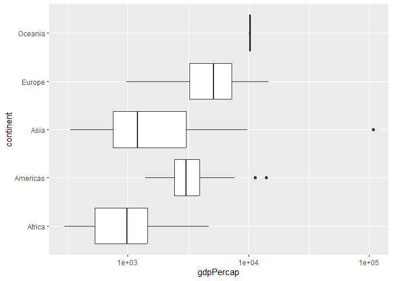
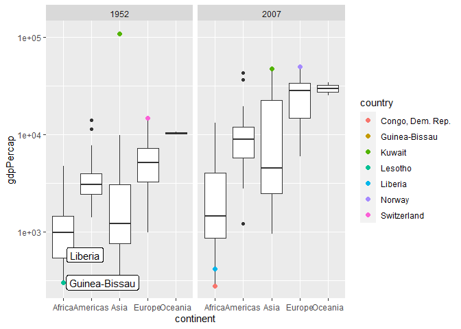
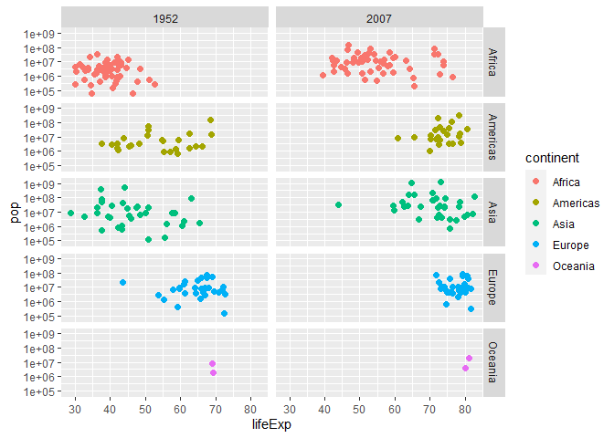
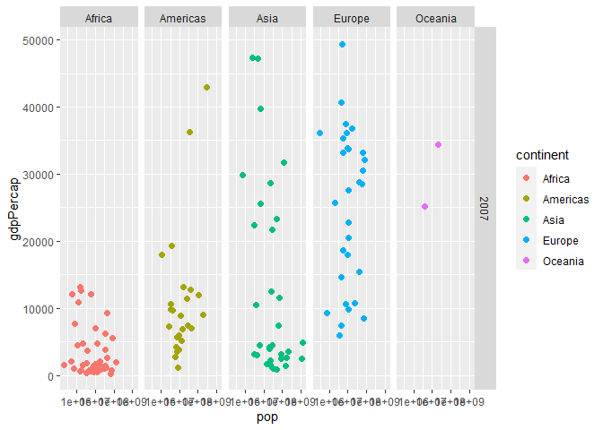
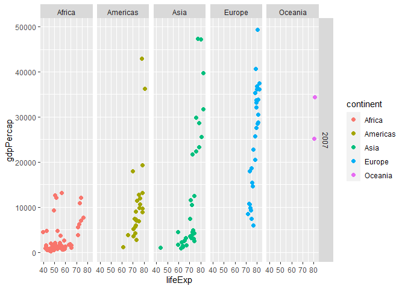

Gapminder
================
Isabella Abilheira
2/22/23

- <a href="#grading-rubric" id="toc-grading-rubric">Grading Rubric</a>
  - <a href="#individual" id="toc-individual">Individual</a>
  - <a href="#due-date" id="toc-due-date">Due Date</a>
- <a href="#guided-eda" id="toc-guided-eda">Guided EDA</a>
  - <a
    href="#q0-perform-your-first-checks-on-the-dataset-what-variables-are-in-this"
    id="toc-q0-perform-your-first-checks-on-the-dataset-what-variables-are-in-this"><strong>q0</strong>
    Perform your “first checks” on the dataset. What variables are in
    this</a>
  - <a
    href="#q1-determine-the-most-and-least-recent-years-in-the-gapminder-dataset"
    id="toc-q1-determine-the-most-and-least-recent-years-in-the-gapminder-dataset"><strong>q1</strong>
    Determine the most and least recent years in the <code>gapminder</code>
    dataset.</a>
  - <a
    href="#q2-filter-on-years-matching-year_min-and-make-a-plot-of-the-gdp-per-capita-against-continent-choose-an-appropriate-geom_-to-visualize-the-data-what-observations-can-you-make"
    id="toc-q2-filter-on-years-matching-year_min-and-make-a-plot-of-the-gdp-per-capita-against-continent-choose-an-appropriate-geom_-to-visualize-the-data-what-observations-can-you-make"><strong>q2</strong>
    Filter on years matching <code>year_min</code>, and make a plot of the
    GDP per capita against continent. Choose an appropriate
    <code>geom_</code> to visualize the data. What observations can you
    make?</a>
  - <a
    href="#q3-you-should-have-found-at-least-three-outliers-in-q2-but-possibly-many-more-identify-those-outliers-figure-out-which-countries-they-are"
    id="toc-q3-you-should-have-found-at-least-three-outliers-in-q2-but-possibly-many-more-identify-those-outliers-figure-out-which-countries-they-are"><strong>q3</strong>
    You should have found <em>at least</em> three outliers in q2 (but
    possibly many more!). Identify those outliers (figure out which
    countries they are).</a>
  - <a
    href="#q4-create-a-plot-similar-to-yours-from-q2-studying-both-year_min-and-year_max-find-a-way-to-highlight-the-outliers-from-q3-on-your-plot-in-a-way-that-lets-you-identify-which-country-is-which-compare-the-patterns-between-year_min-and-year_max"
    id="toc-q4-create-a-plot-similar-to-yours-from-q2-studying-both-year_min-and-year_max-find-a-way-to-highlight-the-outliers-from-q3-on-your-plot-in-a-way-that-lets-you-identify-which-country-is-which-compare-the-patterns-between-year_min-and-year_max"><strong>q4</strong>
    Create a plot similar to yours from q2 studying both
    <code>year_min</code> and <code>year_max</code>. Find a way to highlight
    the outliers from q3 on your plot <em>in a way that lets you identify
    which country is which</em>. Compare the patterns between
    <code>year_min</code> and <code>year_max</code>.</a>
- <a href="#your-own-eda" id="toc-your-own-eda">Your Own EDA</a>
  - <a
    href="#q5-create-at-least-three-new-figures-below-with-each-figure-try-to-pose-new-questions-about-the-data"
    id="toc-q5-create-at-least-three-new-figures-below-with-each-figure-try-to-pose-new-questions-about-the-data"><strong>q5</strong>
    Create <em>at least</em> three new figures below. With each figure, try
    to pose new questions about the data.</a>

*Purpose*: Learning to do EDA well takes practice! In this challenge
you’ll further practice EDA by first completing a guided exploration,
then by conducting your own investigation. This challenge will also give
you a chance to use the wide variety of visual tools we’ve been
learning.

<!-- include-rubric -->

# Grading Rubric

<!-- -------------------------------------------------- -->

Unlike exercises, **challenges will be graded**. The following rubrics
define how you will be graded, both on an individual and team basis.

## Individual

<!-- ------------------------- -->

| Category    | Needs Improvement                                                                                                | Satisfactory                                                                                                               |
|-------------|------------------------------------------------------------------------------------------------------------------|----------------------------------------------------------------------------------------------------------------------------|
| Effort      | Some task **q**’s left unattempted                                                                               | All task **q**’s attempted                                                                                                 |
| Observed    | Did not document observations, or observations incorrect                                                         | Documented correct observations based on analysis                                                                          |
| Supported   | Some observations not clearly supported by analysis                                                              | All observations clearly supported by analysis (table, graph, etc.)                                                        |
| Assessed    | Observations include claims not supported by the data, or reflect a level of certainty not warranted by the data | Observations are appropriately qualified by the quality & relevance of the data and (in)conclusiveness of the support      |
| Specified   | Uses the phrase “more data are necessary” without clarification                                                  | Any statement that “more data are necessary” specifies which *specific* data are needed to answer what *specific* question |
| Code Styled | Violations of the [style guide](https://style.tidyverse.org/) hinder readability                                 | Code sufficiently close to the [style guide](https://style.tidyverse.org/)                                                 |

## Due Date

<!-- ------------------------- -->

All the deliverables stated in the rubrics above are due **at midnight**
before the day of the class discussion of the challenge. See the
[Syllabus](https://docs.google.com/document/d/1qeP6DUS8Djq_A0HMllMqsSqX3a9dbcx1/edit?usp=sharing&ouid=110386251748498665069&rtpof=true&sd=true)
for more information.

``` r
library(tidyverse)
```

    ## ── Attaching packages ─────────────────────────────────────── tidyverse 1.3.2 ──
    ## ✔ ggplot2 3.4.0      ✔ purrr   1.0.1 
    ## ✔ tibble  3.1.8      ✔ dplyr   1.0.10
    ## ✔ tidyr   1.2.1      ✔ stringr 1.5.0 
    ## ✔ readr   2.1.3      ✔ forcats 0.5.2 
    ## ── Conflicts ────────────────────────────────────────── tidyverse_conflicts() ──
    ## ✖ dplyr::filter() masks stats::filter()
    ## ✖ dplyr::lag()    masks stats::lag()

``` r
library(gapminder)
library(ggrepel)
```

*Background*: [Gapminder](https://www.gapminder.org/about-gapminder/) is
an independent organization that seeks to educate people about the state
of the world. They seek to counteract the worldview constructed by a
hype-driven media cycle, and promote a “fact-based worldview” by
focusing on data. The dataset we’ll study in this challenge is from
Gapminder.

# Guided EDA

<!-- -------------------------------------------------- -->

First, we’ll go through a round of *guided EDA*. Try to pay attention to
the high-level process we’re going through—after this guided round
you’ll be responsible for doing another cycle of EDA on your own!

### **q0** Perform your “first checks” on the dataset. What variables are in this

dataset?

``` r
## TASK: Do your "first checks" here!
gapminder %>% glimpse
```

    ## Rows: 1,704
    ## Columns: 6
    ## $ country   <fct> "Afghanistan", "Afghanistan", "Afghanistan", "Afghanistan", …
    ## $ continent <fct> Asia, Asia, Asia, Asia, Asia, Asia, Asia, Asia, Asia, Asia, …
    ## $ year      <int> 1952, 1957, 1962, 1967, 1972, 1977, 1982, 1987, 1992, 1997, …
    ## $ lifeExp   <dbl> 28.801, 30.332, 31.997, 34.020, 36.088, 38.438, 39.854, 40.8…
    ## $ pop       <int> 8425333, 9240934, 10267083, 11537966, 13079460, 14880372, 12…
    ## $ gdpPercap <dbl> 779.4453, 820.8530, 853.1007, 836.1971, 739.9811, 786.1134, …

**Observations**:

- 6 variables: country, continent, year, lifeExp, pop, gdpPercap

### **q1** Determine the most and least recent years in the `gapminder` dataset.

*Hint*: Use the `pull()` function to get a vector out of a tibble.
(Rather than the `$` notation of base R.)

``` r
## TASK: Find the largest and smallest values of `year` in `gapminder`
year_max <- max(gapminder %>% pull(year))

year_min <- min(gapminder %>% pull(year))
```

Use the following test to check your work.

``` r
## NOTE: No need to change this
assertthat::assert_that(year_max %% 7 == 5)
```

    ## [1] TRUE

``` r
assertthat::assert_that(year_max %% 3 == 0)
```

    ## [1] TRUE

``` r
assertthat::assert_that(year_min %% 7 == 6)
```

    ## [1] TRUE

``` r
assertthat::assert_that(year_min %% 3 == 2)
```

    ## [1] TRUE

``` r
if (is_tibble(year_max)) {
  print("year_max is a tibble; try using `pull()` to get a vector")
  assertthat::assert_that(False)
}

print("Nice!")
```

    ## [1] "Nice!"

### **q2** Filter on years matching `year_min`, and make a plot of the GDP per capita against continent. Choose an appropriate `geom_` to visualize the data. What observations can you make?

You may encounter difficulties in visualizing these data; if so document
your challenges and attempt to produce the most informative visual you
can.

``` r
## TASK: Create a visual of gdpPercap vs continent

gapminder %>%
  filter(year == year_min) %>% 
  ggplot() +
  stat_boxplot(aes(continent, gdpPercap)) +
  scale_y_log10() +
  coord_flip()
```

<!-- -->

``` r
gapminder %>% filter(year == year_min) %>% arrange(desc(gdpPercap))
```

    ## # A tibble: 142 × 6
    ##    country        continent  year lifeExp       pop gdpPercap
    ##    <fct>          <fct>     <int>   <dbl>     <int>     <dbl>
    ##  1 Kuwait         Asia       1952    55.6    160000   108382.
    ##  2 Switzerland    Europe     1952    69.6   4815000    14734.
    ##  3 United States  Americas   1952    68.4 157553000    13990.
    ##  4 Canada         Americas   1952    68.8  14785584    11367.
    ##  5 New Zealand    Oceania    1952    69.4   1994794    10557.
    ##  6 Norway         Europe     1952    72.7   3327728    10095.
    ##  7 Australia      Oceania    1952    69.1   8691212    10040.
    ##  8 United Kingdom Europe     1952    69.2  50430000     9980.
    ##  9 Bahrain        Asia       1952    50.9    120447     9867.
    ## 10 Denmark        Europe     1952    70.8   4334000     9692.
    ## # … with 132 more rows

**Observations**:

- Each of Africa’s gdpPercap were less than 5000
- Oceania’s gdpPercap were both around 10000
- All but one of Asia’s gdpPercap were less than 10000
- The Americas’ gdpPercap has a cluster around 2500
- Europe has the second highest gdpPercap at almost 15000
- Asia had one gdpPercap that was over 100000

**Difficulties & Approaches**:

- Asia had one gdpPercap that was greater than 90000 which was an
  outlier and squished the rest of the data so a logscale was used to
  increase readability
- Oceania’s box is still pretty unreadable, likely due to a small number
  of data

### **q3** You should have found *at least* three outliers in q2 (but possibly many more!). Identify those outliers (figure out which countries they are).

``` r
## TASK: Identify the outliers from q2
gapminder %>%
  filter(year == year_min) %>% 
  group_by(continent) %>% 
  filter(!continent == "Oceania") %>% 
  filter(
    gdpPercap < quantile(gdpPercap, 0.01) | 
    gdpPercap > quantile(gdpPercap, 0.99)
  )
```

    ## # A tibble: 8 × 6
    ## # Groups:   continent [4]
    ##   country                continent  year lifeExp       pop gdpPercap
    ##   <fct>                  <fct>     <int>   <dbl>     <int>     <dbl>
    ## 1 Bosnia and Herzegovina Europe     1952    53.8   2791000      974.
    ## 2 Dominican Republic     Americas   1952    45.9   2491346     1398.
    ## 3 Kuwait                 Asia       1952    55.6    160000   108382.
    ## 4 Lesotho                Africa     1952    42.1    748747      299.
    ## 5 Myanmar                Asia       1952    36.3  20092996      331 
    ## 6 South Africa           Africa     1952    45.0  14264935     4725.
    ## 7 Switzerland            Europe     1952    69.6   4815000    14734.
    ## 8 United States          Americas   1952    68.4 157553000    13990.

**Observations**:

- Identify the outlier countries from q2
  - There are 3 outlier countries:
    - Kuwait with a gdpPercap of 108382.3529
    - United States with a gdpPercap 13990.4821
    - Canada with a gdpPercap 11367.1611

*Hint*: For the next task, it’s helpful to know a ggplot trick we’ll
learn in an upcoming exercise: You can use the `data` argument inside
any `geom_*` to modify the data that will be plotted *by that geom
only*. For instance, you can use this trick to filter a set of points to
label:

``` r
## NOTE: No need to edit, use ideas from this in q4 below
gapminder %>%
  filter(year == max(year)) %>%

  ggplot(aes(continent, lifeExp)) +
  geom_boxplot() +
  geom_point(
    data = . %>% filter(country %in% c("United Kingdom", "Japan", "Zambia")),
    mapping = aes(color = country),
    size = 2
  )
```

<!-- -->

### **q4** Create a plot similar to yours from q2 studying both `year_min` and `year_max`. Find a way to highlight the outliers from q3 on your plot *in a way that lets you identify which country is which*. Compare the patterns between `year_min` and `year_max`.

*Hint*: We’ve learned a lot of different ways to show multiple
variables; think about using different aesthetics or facets.

``` r
## TASK: Create a visual of gdpPercap vs continent
gapminder %>%
  filter(year == max(year) | year == min(year)) %>%
  
  ggplot(aes(continent, gdpPercap)) +
  geom_boxplot() +
  scale_y_log10() +
  facet_wrap(~year) +
  
  geom_point(
    data = . %>% 
      group_by(year) %>%
      filter(
          gdpPercap < quantile(gdpPercap, 0.01) | 
          gdpPercap > quantile(gdpPercap, 0.99)
      ),
    mapping = aes(color = country),
    size = 2
  ) +
  geom_label_repel(
    data = . %>%
      filter(
        country %in% c("Guinea-Bissau", "Liberia"),
        year == 1952
      ),
    mapping = aes(label = country)
  )
```

<!-- -->

**Observations**:

- Kuwait is an outlier in both 1952 and 2007
- All of the continents gdpPercap median increased from 1952 to 2007
- Asia’s, Africa’s, America’s and Europe’s upper quartile increased
  significantly from 1952 to 2007
  - Europe’s upper quartile had the largest increased
  - Additionally, Europe’s lower quartile increased the most from 1952
    to 2007
- Oceania’s data is still hard to read likely because there are fewer
  data points

# Your Own EDA

<!-- -------------------------------------------------- -->

Now it’s your turn! We just went through guided EDA considering the GDP
per capita at two time points. You can continue looking at outliers,
consider different years, repeat the exercise with `lifeExp`, consider
the relationship between variables, or something else entirely.

### **q5** Create *at least* three new figures below. With each figure, try to pose new questions about the data.

``` r
## TASK: Your first graph
## population and lifeExp
gapminder %>%
  filter(year == max(year) | year == min(year)) %>%
           
  ggplot(aes(lifeExp, pop)) +
  geom_point(
    mapping = aes(color = continent),
    size = 2
  ) +
  scale_y_log10() +
  facet_grid(vars(continent), vars(year))
```

<!-- -->

- lifeExp of all continents seem to have generally gone up from 1952 to
  2007
- All countries in Europe’s lifeExp in 2007 is above 70 years
- Asia in 2007 has one major outlier where the lifeExp is around 45
  years
  - the rest of Asia’s life expectancies span from approx. 60-85 years
- The America’s lifeExp had quite a wide range in 1952, which decreased
  by 2007
  - Africa had the opposite trend where there was a small span in 1952
    and the span increased by 2007
- Asia was the continent with the lowest lifeExp in 1952 compared to the
  lifeExp of all of the other continents
- Africa was the continent with the lowest lifeExp in 2007 compared to
  the lifeExp of all of the other continents

``` r
## TASK: Your second graph
## population and gdp

gapminder %>%
  filter(year == max(year)) %>%
           
  ggplot(aes(pop, gdpPercap)) +
  geom_point(
    mapping = aes(color = continent),
    size = 2
  ) +
  scale_x_log10() +
  facet_grid(vars(year), vars(continent))
```

<!-- -->

- My initial theory was that as the pop increases the gdpPercap would
  also increase and create a strong positive correlation but clearly
  that is not the case
  - In the America’s there seem to be two countries that follow this
    trend
- Africa’s gdpPercap are all below 15000 with many clustered around
  1000/2000
- Asia and Europe have a large range of gdpPercap
- Europe has the highest gdpPercap

``` r
## TASK: Your third graph
## gdp lifeExp

gapminder %>%
  filter(year == max(year)) %>%
           
  ggplot(aes(lifeExp, gdpPercap)) +
  geom_point(
    mapping = aes(color = continent),
    size = 2
  ) +
  facet_grid(vars(year), vars(continent))
```

<!-- -->

- European countries all have a similar lifeExp (also observed in graph
  1)
- There are many countries that have a high lifeExp and a high gdpPercap
- The America’s have a cluster of gdpPercap around 10000 all with very
  similar lifeExp
- Some countries in Africa’s gdpPercap at a lifeExp of 70 is higher than
  half of the countries n=in the America’s and Asia
  - Some countries in Africa’s gdpPercap at a lifeExp of 70 is lower
    than Europe and Oceania’s
